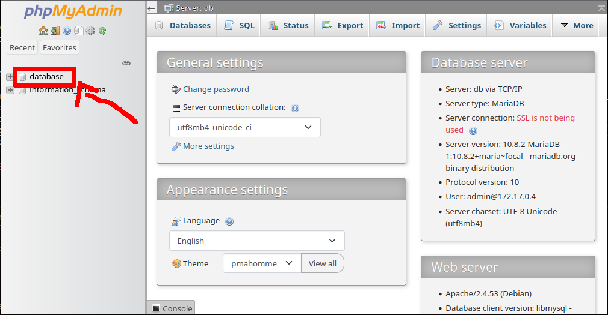
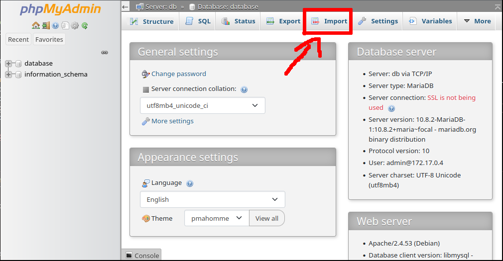
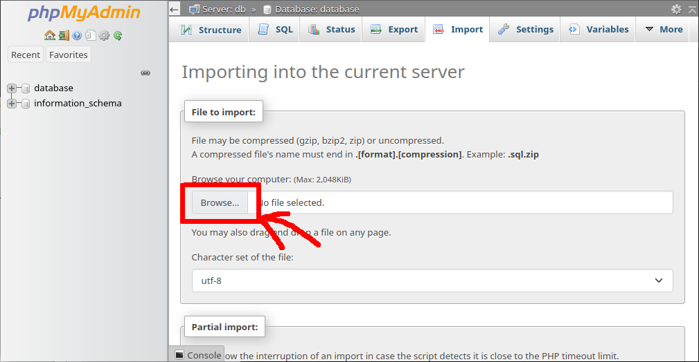
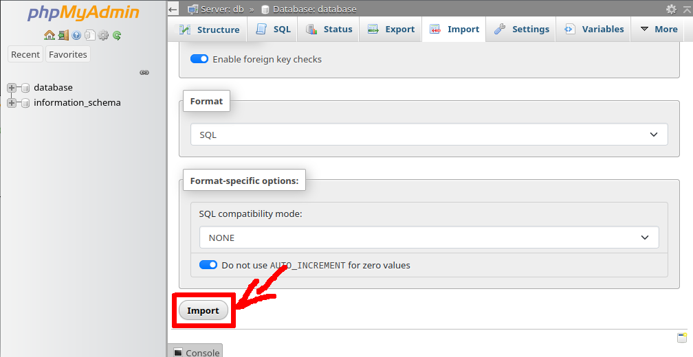

# Librerium
Página web para publicar libros, reseñarlos y comentarlos.

## Instrucciones
1. Crear el contenedor **web**:
    * `$ sudo docker build -t="web" .`
2. Iniciar los contenedores:
    * `$ sudo docker-compose up -d`
3. Asegurarse de que el contenedor **librerium_web_1** existe:
    * `$ sudo docker ps -a`
4. En caso de no existir, cambiar el comando del paso 5 para que sea el contenedor que tenga **web** en alguna parte de su nombre, en vez de `librerium_web_1`
5. Dar permiso a php para escribir en **/home/www-data/uploads**:
    * `$ sudo docker exec librerium_web_1 chown www-data:www-data /var/www/html/uploads`
6. Abrir el navegador en **http://localhost:8890/**
8. Iniciar sesión con usuario: **admin**, contraseña: **test**
7. Importar la base de datos **database.sql**:
    1. Seleccionar la base de datos **database** 
    2. Cambiar a la pestaña **import** 
    3. Pinchar en **browse** y elegir **database.sql** 
    4. Scrollear al final de la página y pinchar en **import** 
8. Abrir el navegador en **http://localhost:81/**
